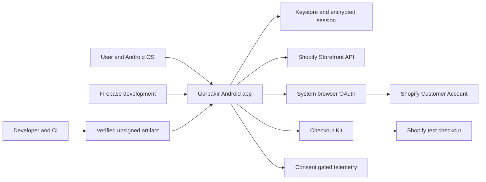

# Gürbakır Native Android Phase 2 Threat Model

Date: 2026-08-06
Status: updated for the completed local/owned-service Phase 2 foundation; physical-device observations remain governed by the gate reports

## Executive summary

The highest-risk areas are customer OAuth/session material, URL/discovery/callback confusion across Android/browser/Shopify boundaries, Checkout Kit and offsite navigation, Firebase operator/send authority, and build/release supply-chain integrity. The current foundation reduces those risks with one-time S256 PKCE state, strict runtime discovery validation, Android Keystore-backed AES-GCM session and cart storage, fail-closed typed configuration, separate typed GraphQL clients, exact route and owned checkout-host allowlists, redacting value types/logging, explicit-consent FCM registration, disabled telemetry defaults, isolated Firebase environments, pinned dependency verification, and an unsigned release boundary. Physical proofs now cover OAuth/PKCE, session/cart Keystore restoration and corruption failure, Checkout Kit/Bogus approval and decline behavior, and controlled Firebase Remote Config/FCM delivery/navigation/unregister. The most important remaining release work is to reduce shared Customer Account permissions, approve production identity/signing and consent ownership, and preserve the verified boundaries as the full product is implemented.

## Scope and assumptions

In scope:

- Runtime code under `app/src`, `foundation/src`, `storefront/src`, `account/src`, `checkout/src`, and `firebase/src`.
- Build and supply-chain controls in the Gradle files, `gradle/verification-metadata.xml`, module lockfiles, `.github/workflows/android-foundation.yml`, `.gitleaks.toml`, and `scripts/Test-Phase2Foundation.ps1`.
- Project-owned Gürbakır Shopify Storefront, Customer Account, and checkout boundaries plus isolated project-owned Firebase development/staging boundaries.
- Local Android Keystore/session persistence, external URI handling, diagnostic sinks, and future production signing/CI boundaries.

Out of scope:

- The immutable reference APK, third-party reference services, and the old Flutter prototype; they are not runtime/build inputs and must never be contacted (`AGENTS.md`; `docs/preparation/SOURCE-OF-TRUTH-AND-PROVENANCE.md`).
- A project backend: the owner confirmed none exists in Phase 2 and one requires a later requirement and ADR.
- Real customers, payments, production mutations, publication, iOS, and broad implementation of the 24 candidate feature groups.

Validated assumptions that drive risk ranking:

- The owner designates the paid-but-unlaunched Gürbakır Shopify store as the authorized non-production Phase 2 test environment; it is not open for customer sales and only synthetic identities, addresses, carts, and orders may be used.
- Analytics and Crashlytics remain disabled until a consent/privacy policy is approved (`config/local.defaults.properties`; owner confirmation on 2026-07-19).
- One approved Android 13 phone completed the current connected suites and manual OAuth, Keystore, Storefront cart, Checkout Kit/Bogus, Remote Config, and controlled FCM proofs. Device connection is a point-in-time fact and must be rechecked for later feature work (`docs/phase2/DEVICE-TEST-EVIDENCE.md`).
- Customer Account OAuth scopes are fixed to Shopify's required mobile set, but the Headless channel's shared Customer Account resource permissions are currently broader than this foundation proof needs. They were not changed because doing so can affect other owned consumers; least-privilege reduction is required before approving Phase 3 account capabilities.
- Development/staging application IDs are provisional; the permanent production application ID, Play identity, upload key, and Play App Signing owner are unapproved (`app/build.gradle.kts`; ADR-0003).
- The mobile client has no legitimate Admin API credential, Firebase service-account material, backend secret, or confidential OAuth client secret.

Open questions that materially affect later release risk:

- Who owns production signing, Play App Signing recovery, CI environment approvals, and emergency release rollback?
- Which telemetry events, jurisdictions, consent lifecycle, retention period, and deletion/access process will be approved?
- Which exact production OAuth callbacks, HTTPS App Links, Shopify checkout hosts, Firebase project/app IDs, markets, and least-privilege shared Customer Account resource permissions will be allowed?

## System model

### Primary components

- **Application shell:** single-activity Compose UI, typed Navigation Compose routes, UDF `StateFlow`, and Hilt wiring (`app/src/main/kotlin/com/gurbakir/mobile`).
- **Foundation:** typed public-client configuration, environment identity, external-route policy, error taxonomy, redacting logger, and design tokens (`foundation/src/main/kotlin/com/gurbakir/foundation`).
- **Storefront boundary:** a versioned owned-store schema, generated operation-specific Apollo shop/catalog/cart models, bounded request/client mapping, explicit configuration/transport/HTTP/GraphQL/Shopify user-error/invalid-cart failures, and an opt-in owned-store read proof (`storefront/src/main`).
- **Account boundary:** strict live OIDC/Customer API discovery, a dedicated saved Shopify Public Mobile client/callback, AppAuth Custom Tabs and end-session presentation, exact no-redirect OkHttp authorization-code exchange/refresh, S256 PKCE, independent nonce, one-time expiring state, typed Customer Account Apollo models, sensitive-code/token wrappers, and environment-separated Keystore AES-GCM session persistence (`account/src/main/kotlin/com/gurbakir/account`).
- **Checkout boundary:** project-owned adapter around the official Shopify Checkout Kit with restricted SDK event handling and allowlisted checkout hosts (`checkout/src/main/kotlin/com/gurbakir/checkout`).
- **Firebase boundary:** typed safe Remote Config defaults, explicit permission/Installation ID registration and unregister, disabled analytics reporter, a non-exported messaging service with one exact allowlisted route and fixed local notification content, a complete four-variant config guard/validator, and manifest-level Analytics/Crashlytics/FCM/ad-ID opt-out defaults (`firebase/`, `app/build.gradle.kts`, `app/src/main/AndroidManifest.xml`).
- **Build/CI boundary:** pinned wrapper/catalog, dependency locks and SHA-256 verification, full-SHA GitHub Actions, lint/tests/release checks, and secret scanning (`gradle/`; `.github/workflows/android-foundation.yml`).

### Data flows and trust boundaries

- **User and Android OS -> app shell:** taps, typed content, lifecycle intents, notification/deep-link URIs, and OAuth callbacks cross Android intent/UI boundaries. Typed routes and URI policies constrain destinations; AppAuth's exported receiver and the saved dedicated Mobile client are bound to the same verified discovery-derived scheme. Physical redirect and exact notification-route proofs passed; custom-scheme competition remains a platform residual risk until production HTTPS App Links are approved.
- **App -> Shopify Storefront:** generated shop/catalog/cart GraphQL plus an extractable controlled public token cross HTTPS. Configuration validates host/API version/token presence; generated read and synthetic create/read/add/update/remove paths, header injection, timeout, safe mapping, redaction, and cleanup were observed against the owned store. Broader product traffic, throttling, and cache behavior remain Phase 3/runtime work.
- **App -> Shopify discovery -> system browser/token/end-session/Customer Account GraphQL:** discovery is fetched only from the exact verified HTTPS shop host with redirects disabled, bounded documents, exact issuer, S256/authorization-code/RS256 checks, and HTTPS endpoints. Authorization carries the dedicated public client ID, exact scopes/callback, state, nonce, and S256 challenge. AppAuth presents browser and end-session flows; exact OkHttp form POSTs perform exchange/refresh and accept an omitted `token_type` while rejecting a non-`Bearer` value. The Customer Account Apollo client sends Shopify's raw token value in `Authorization` without a guessed prefix. Logout always clears local credentials after the discovered end-session attempt. Physical callback, exchange, identity, refresh, restoration, and logout passed with a synthetic account.
- **App -> Android Keystore and private preferences:** access/refresh/ID tokens and expiry cross the process-to-local-storage boundary. AES-GCM uses a non-exportable environment-specific key and fresh IV; only ciphertext is persisted, backup is disabled, and corruption clears the session.
- **App -> Checkout Kit -> Shopify/offsite provider:** an owned-cart HTTPS checkout URL, restricted to the exact configured host, and SDK lifecycle events cross an SDK-owned WebView/network boundary. The real URL shape is validated and redacted; SDK payloads/messages are not exposed; permissions, file selection, geolocation, and web-pixel forwarding default-deny; external links return to project policy. Physical preload/render/cancel/complete/restoration and Bogus approval/decline paths passed; one paid test order was reconciled read-only and no real payment was made.
- **Firebase -> app:** Remote Config and FCM payloads cross Google/project infrastructure into the device. Only two approved boolean flags and one exact route are modeled; unavailable config falls back locally, remote display text is ignored, and manual registration begins only after user permission/action. A controlled development-project message, tap navigation, Remote Config fetch/activate, and unregister cleanup passed. Client configuration is public, while sender/service-account authority must never enter the app.
- **App -> analytics/crash services:** event and crash metadata would cross a privacy boundary. Tracked defaults are disabled and `DisabledAnalyticsReporter` emits nothing; later initialization must remain consent-gated and exclude PII, tokens, URLs, GraphQL bodies, checkout/payment data, and free text.
- **Developer/CI -> build artifact:** source, dependency metadata, public configuration, and signing inputs cross developer/CI/supply-chain boundaries. Hash verification, locks, pinned actions, read-only permissions, redacted secret scans, and unsigned release verification exist; production signing controls do not yet exist.

#### Diagram

## Assets and security objectives

| Asset | Why it matters | Security objective (C/I/A) |
| --- | --- | --- |
| Customer access/refresh tokens, authorization code, PKCE verifier, OAuth state | Theft enables customer impersonation; replay/confusion can bind the wrong session | C, I |
| Customer profile, address, order, cart, and checkout context | Private commerce/identity data can harm users and create legal obligations | C, I |
| Storefront public token and API quota | Extractable by design but abuse can scrape catalog, create carts, or exhaust quota | I, A |
| OAuth callback/client/scopes/endpoints | Incorrect binding enables interception, open redirect, or over-broad authority | I |
| Cart ID and checkout URL | May provide access to mutable checkout state and must not leak through logs | C, I |
| Firebase client configuration, FCM tokens, Remote Config values | Misconfiguration can route messages to the wrong app/project or alter UX/availability | C, I, A |
| Analytics/crash data and consent state | Telemetry can silently expose PII or violate consent/retention promises | C, I |
| Android package identity and signing keys | Compromise enables malicious updates indistinguishable from the legitimate app | C, I |
| Source, dependency graph, CI workflow, and build artifacts | Supply-chain compromise can insert credential theft into every install | I, A |
| Release availability, legal/support routes, and safe local defaults | Remote failure or malicious config must not brick critical access | A, I |

## Attacker model

### Capabilities

- A remote attacker can send crafted HTTPS links, custom-scheme callbacks, notification data, GraphQL responses/errors, merchant content, and offsite checkout redirects where those surfaces are enabled.
- An attacker can extract public Android resources, BuildConfig values, Firebase client identifiers, and the controlled Storefront token from an APK.
- A malicious or compromised dependency/repository/CI action can attempt build-time code injection; a compromised developer or CI principal can modify source/configuration within their granted access.
- A malicious local app can register competing custom schemes, send explicit/implicit intents, read screenshots/notifications subject to Android controls, and interact with exported components.
- An attacker controlling an unlocked, rooted, instrumented, or otherwise compromised device may inspect process memory or hook network/token consumers despite Keystore encryption at rest.

### Non-capabilities

- A normal remote attacker does not possess Shopify Admin credentials, Firebase service-account/send authority, production signing keys, or direct Android Keystore key export.
- The app does not expose a project backend, listener, upload endpoint, database, arbitrary file parser, scripting/eval surface, Admin API client, or Firebase database/storage product in Phase 2.
- The Storefront token is not treated as a confidential server secret and cannot authorize Admin operations.
- The reference APK and third-party reference services are not reachable through this app's intended configuration and are explicitly excluded from testing.

## Entry points and attack surfaces

| Surface | How reached | Trust boundary | Notes | Evidence (repo path / symbol) |
| --- | --- | --- | --- | --- |
| Launcher activity and future Android intents | Android activity launch/deep link/notification | OS -> app | Launcher plus AppAuth receiver; receiver scheme comes from verified ignored config and callback parser enforces the full route | `app/src/main/AndroidManifest.xml`; merged manifest; `CustomerAccountAuthorization.kt` |
| External HTTPS/custom-scheme URI | Notification, merchant content, checkout/offsite callback | Untrusted URI -> app/navigation | Host/scheme allowlist, no user info, normal HTTPS port | `foundation/.../ExternalRoutePolicy.kt` |
| Storefront GraphQL | App HTTP client using controlled public token | App -> Shopify | Versioned schema/generated operations, header/timeout mapping, mock contracts, and owned shop/catalog read proof | `storefront/.../ApolloStorefrontGateway.kt`; `OwnedStorefrontReadProofTest.kt` |
| OAuth discovery/authorization/token/logout | Trusted shop discovery, system browser, custom-scheme return, token/end-session HTTPS | Network/browser/OS -> account module | Exact host/issuer/HTTPS/capability validation, bounded no-redirect discovery, S256/state/nonce, exact callback, AppAuth browser/end-session, exact OkHttp exchange/refresh, saved Mobile client; physical proof passed | `CustomerAccountDiscovery.kt`; `CustomerAccountAuthorization.kt`; `CustomerAccountTokenClient.kt`; `CustomerAccountLogoutClient.kt` |
| Customer Account GraphQL | Authenticated typed query with Shopify raw-token authorization | App -> Shopify Customer Account | Separate discovered endpoint/schema/client; signed-out/discovery/transport/GraphQL failures fail closed without raw messages | `account/.../CustomerAccountGateway.kt`; `CustomerAccountGatewayTest.kt` |
| Token persistence | Session exchange/restore/refresh/logout/corrupt local state | App process -> local storage/Keystore | AES-GCM, fresh IV, environment key, bounded access/refresh/ID-token payload, expiry/claim checks, fail closed | `CustomerAccountSessionCoordinator.kt`; `AndroidKeystoreCustomerSessionStore.kt` |
| Checkout URL and SDK events | Typed cart checkout URL into Checkout Kit | App -> SDK WebView/Shopify/offsite | HTTPS host allowlist; restricted event processor; default-deny device requests | `checkout/.../CheckoutAdapter.kt`; `OfficialCheckoutKitClient.kt` |
| FCM notification route | Firebase message data | Firebase/Internet -> app | Explicit consent registration; exactly one route key; fixed local content; non-exported service; immutable explicit app intent; physical controlled delivery/tap passed | `firebase/.../NotificationRouteParser`; `app/.../GurbakirFirebaseMessagingService.kt` |
| Remote feature flags | Firebase fetch/activation | Firebase -> app behavior | Two-key enum allowlist and false local defaults; no executable endpoints/code; physical explicit fetch/activate passed | `firebase/.../ApprovedRemoteFlag`; `FirebaseRemoteFeatureFlags` |
| Logger and future telemetry | Internal errors/events and SDK callbacks | App data -> logs/third party | Stable event IDs, attribute allowlist, bounded single-line redaction, telemetry disabled | `foundation/.../ProjectLogger.kt`; `config/local.defaults.properties` |
| Gradle/CI dependencies and actions | Build resolution and GitHub workflow | Internet/repository -> artifact | SHA verification, locks, full action SHAs, no persisted checkout credential | `gradle/verification-metadata.xml`; `.github/workflows/android-foundation.yml` |
| Local/CI configuration and future signing | Ignored properties, Firebase files, CI secrets, signing job | Operator/CI -> artifact | Secret classes documented; production signing not yet provisioned | `config/`; `.gitignore`; `docs/phase2/CONFIGURATION-AND-SECRETS.md` |

## Top abuse paths

1. An attacker registers a competing custom scheme -> convinces a user to authorize -> intercepts the redirect code -> attempts exchange or session confusion. Impact: customer-account takeover if PKCE/callback binding is wrong.
2. A crafted callback with mismatched or replayed state reaches the app -> application accepts it more than once -> attacker binds an authorization response to the wrong initiation. Impact: login CSRF/session confusion.
3. A token, checkout URL, GraphQL payload, or customer field reaches a log/crash/analytics attribute -> third-party telemetry or local logs retain it -> another principal retrieves it. Impact: impersonation or PII exposure.
4. A malicious deep link, FCM route, merchant URL, or Checkout Kit external link requests an attacker host -> app launches it without an exact allowlist -> user is phished or sensitive query data leaves the app.
5. An extracted Storefront token is automated at scale -> attacker scrapes catalog or creates excessive carts/requests -> Shopify quota or availability is degraded. Impact: service cost/availability rather than Admin compromise.
6. An attacker substitutes a checkout URL -> app passes it into an SDK WebView -> user enters checkout information into the wrong origin. Impact: credential/payment phishing; host binding is therefore release-critical.
7. A Firebase app is registered to the wrong project/package or Remote Config/FCM authorization is over-broad -> attacker/incorrect operator sends malicious flags/routes -> app navigation, availability, or user trust is harmed.
8. A compromised Gradle artifact, plugin, GitHub Action, or CI secret injects code -> signed build captures sessions or redirects checkout -> malicious update reaches users. Impact: fleet-wide compromise.
9. A rooted/instrumented device hooks the process after token decryption -> extracts a live access token despite secure at-rest storage -> attacker reuses it until expiry/revocation. Impact: individual customer compromise; accepted platform residual risk.

## Threat model table

| Threat ID | Threat source | Prerequisites | Threat action | Impact | Impacted assets | Existing controls (evidence) | Gaps | Recommended mitigations | Detection ideas | Likelihood | Impact severity | Priority |
| --- | --- | --- | --- | --- | --- | --- | --- | --- | --- | --- | --- | --- |
| TM-001 | Malicious local app, link sender, or discovery/network attacker | OAuth Mobile client and custom-scheme receiver are enabled | Substitute endpoints or intercept/confuse callback; inject mismatched/replayed state | Customer session theft, credential exfiltration, or login CSRF | OAuth code, verifier, nonce, state, access/refresh/ID tokens | Dedicated saved Mobile client/callback; exact trusted shop discovery host; no redirects; 128 KiB bounds; exact issuer; HTTPS endpoints; authorization-code/S256/RS256 capability checks; S256; independent state/nonce; exact callback; duplicate-key rejection; constant-time one-time consume/expiry; AppAuth browser/end-session; exact no-redirect exchange/refresh; physical callback/identity/refresh/restore/logout proof (`CustomerAccountDiscovery.kt`, `CustomerAccountAuthorization.kt`, `CustomerAccountTokenClient.kt`, `CustomerAccountLogoutClient.kt`) | Custom-scheme competition remains a platform risk; shared Admin resource permissions remain broader than the foundation needs | Account owner: retain callback/replay/cancel/process-death regression tests; approve HTTPS App Links for production; keep runtime discovery authoritative; narrow shared permissions before full account features; monitor/revoke anomalous sessions | Count typed discovery/callback/token/logout failure categories without URLs, state, tokens, or raw messages; alert on repeated mismatch by coarse app version/environment | medium | high | high |
| TM-002 | Compromised device, developer mistake, or diagnostic SDK | A live token/customer/checkout value enters process memory or an error path | Exfiltrate via logs, screenshots, crash reports, analytics, backup, or plaintext storage | Customer impersonation and PII leakage | Tokens, PII, cart/order/checkout data | Redacting token wrappers/logger; backup disabled; independent customer/cart Keystore AES-GCM stores; bounded payloads; telemetry false; physical restore/corruption/logout proof (`SessionContracts.kt`, `AndroidKeystoreCustomerSessionStore.kt`, `AndroidKeystoreCartSessionStore.kt`, `ProjectLogger.kt`, manifest/defaults) | Runtime must hold plaintext briefly; a rooted/instrumented process can still observe it | Security/account owners: keep token consumers narrow, zero temporary bytes where feasible, prohibit bodies/free text, retain logcat/artifact and Keystore corruption/restart/logout tests; define revocation | CI redaction tests; debug-only canary scans for synthetic markers; coarse terminal-session-reset counters | medium | high | high |
| TM-003 | Remote link sender, FCM sender, merchant content, or offsite page | App consumes an external URI | Supply user-info, non-HTTPS, attacker host/scheme, or credential query | Phishing, unintended component launch, data disclosure | Navigation integrity, user trust, tokens in URLs | `ExternalRoutePolicy`, notification length bound, checkout external link returned as data (`ExternalRoutePolicy.kt`, `FirebaseContracts.kt`, `OfficialCheckoutKitClient.kt`) | Final host/scheme/App Link lists and consumer-side launch policy are pending | Navigation owner: exact per-environment allowlists; parse once to typed URI; strip/reject credential query keys; verify resolved intent ownership; test malformed/redirect chains and app-link certificate binding | Record only failure category and normalized approved host ID, never raw URI | medium | medium | medium |
| TM-004 | APK extractor or automated Storefront client | Public token is extracted, as expected | Scrape catalog, create excessive carts, or consume API capacity | Quota/cost/availability degradation; not Admin compromise | Storefront quota, catalog integrity, availability | Token is classified controlled/extractable and redacts itself; config validates owned endpoint/API version; generated Apollo client bounds pagination/input/timeouts; owned read and bounded create/remove/add/update/read/final-remove proofs passed; no Admin secret (`AppConfiguration.kt`, `ApolloStorefrontGateway.kt`, proof report) | Throttling/cache/cancellation under device network transitions and token rotation/monitoring are not verified | Shopify owner: least Storefront access, environment separation, rotate on abuse, bounded retry/cache, monitor API usage; never elevate token scope | Shopify API usage anomalies; client retry/circuit metrics without tokens/query variables | medium | medium | medium |
| TM-005 | Malicious GraphQL/merchant data or substituted checkout URL | Live cart returns attacker-controlled or tampered destination | Feed non-owned HTTPS origin to Checkout Kit or abuse offsite return | Checkout phishing, cart corruption, sensitive data exposure | Cart ID, checkout URL, customer/payment trust | Explicit cart failure taxonomy; valid cart survives transient failure; real owned checkout host bound to the exact configured host; refresh before launch; preloaded state invalidated after mutation; SDK permissions/geolocation/file choice/web-pixel forwarding default-deny; messages/payloads suppressed; physical preload/render/cancel/complete/restore and Bogus approval/decline with read-only order reconciliation (`StorefrontGateway.kt`, `CartCoordinator.kt`, `CommerceProofController.kt`, `CheckoutAdapter.kt`, `OfficialCheckoutKitClient.kt`) | Full product UX, additional approved offsite providers, and production host/signing policy remain later release work | Checkout owner: keep the exact verified host set, bind session/cart, reconcile completion with Shopify truth, invalidate only explicit complete/expired carts, retain offsite/cancel/recreate regression tests | Typed lifecycle counts and host-policy rejects; no full URL/order/payment fields | medium | high | medium |
| TM-006 | Wrong Firebase project/app, compromised Firebase operator, or unauthorized sender | Firebase is registered or products are enabled | Deliver malicious notification route/flag or expose project data through weak rules | Navigation abuse, feature denial, identifier exposure | Installation IDs, config integrity, availability | Tracked defaults disabled; exact development/staging debug/release packages; one project per environment and distinct-project validation; debug SHA-256 registrations; all Google Services processors pass; Analytics/Crashlytics/FCM/ad-ID defaults false; explicit permission/register/unregister; approved two-flag enum and false fallback; exact route/fixed content/non-exported service; physical development delivery/tap and Remote Config fetch/activate; no DB/Storage/Auth products (`Test-FirebaseConfiguration.ps1`, manifest, `FirebaseContracts.kt`, Firebase proof) | Firebase IAM/API restrictions still require periodic owner audit; production project/push and broad notification operations are intentionally absent | Firebase owner: least IAM/API restrictions; periodically audit app/package/SHA mappings and preserve environment isolation; Security Rules/App Check only if a data product is later added; registration endpoint only after backend ADR; typed payload schema/TTL | Firebase audit logs, unexpected sender/config/app changes, invalid route/flag counters, environment fingerprint drift | low | high | medium |
| TM-007 | Developer, product operator, or telemetry SDK | Analytics/Crashlytics initialized before valid policy/consent | Send PII, tokens, URLs, free text, or pre-consent crashes | Privacy breach and durable third-party disclosure | Customer data, tokens, consent state | Defaults false; disabled reporter; safe attribute enum; redaction (`local.defaults.properties`, `FirebaseContracts.kt`, `ProjectLogger.kt`) | No approved consent state machine, taxonomy, retention, or deletion/access path | Privacy owner: keep collection disabled; approve low-cardinality schema and lawful basis; gate initialization and queued events; consent withdrawal must stop/clear where SDK permits; add synthetic no-network/device tests | Consent-state transition audit without identity; CI allowlist checks; Firebase DebugView only with synthetic event after approval | low | high | medium |
| TM-008 | Compromised dependency repository, build plugin, GitHub Action, or contributor | Build resolves altered code or workflow gains excessive rights | Inject credential theft, endpoint replacement, or malicious update logic | Fleet-wide account/checkout compromise | Source, dependency graph, CI, artifacts | Wrapper distribution and jar hashes; dependency SHA metadata and locks; full action SHAs; read-only contents; no persisted checkout credentials; gitleaks (`gradle/`, workflow, `.gitleaks.toml`) | No protected remote/branch or signing CI exists yet; artifact provenance/SBOM not configured | Build owner: review lock/hash diffs, keep action SHAs and least permissions, protected environments/reviews, isolated signing, dependency review/SBOM/provenance, reproducible release comparison, patch cadence | Alert on workflow/lock/verification/signing changes; artifact hash/provenance verification; secret-scan CI | low | high | high |
| TM-009 | Compromised release operator or CI principal | Production package/signing pipeline is later introduced | Steal upload/signing material or authorize malicious release | Irreversible malicious-update trust and recovery cost | Package identity, signing keys, release channel | No production ID/key in repo; signing/private material ignored; release build unsigned (`app/build.gradle.kts`, `.gitignore`, `CONFIGURATION-AND-SECRETS.md`) | Owner, HSM/CI boundary, Play App Signing recovery, key rotation, and approval policy are undecided | Release owner: adopt Play App Signing, isolate upload key in approved secret/HSM boundary, two-person production approval, document fingerprints/recovery/rotation, prohibit local production signing in general builds | Play Console alerts, certificate/fingerprint checks, signed provenance, release diff and approver audit | low | high | medium |
| TM-010 | Firebase operator error or compromised config | Remote Config is enabled | Set malformed/stale values or permanent force-update/maintenance flag | App denial of service or support/legal lockout | Availability, configuration integrity | Exactly two enum booleans; false local defaults; no endpoint/code selection; physical explicit fetch/activate passed (`ApprovedRemoteFlag`, `FirebaseRemoteFeatureFlags`) | Production max-age, rollback ownership, and broader feature-flag policy are not approved | Product/Firebase owners: retain schema/range and offline tests; define max-age/rollback/emergency owner before production; never change trust endpoints/consent; preserve legal/support access | Fetch outcome and config version metadata only; alert on emergency flag changes | low | medium | low |
| TM-011 | Rooted-device owner, malware with process instrumentation, physical attacker | Device/app process is compromised while session is live | Hook token consumer, inspect memory, overlay/phish, or manipulate local state | Individual session/customer compromise | Tokens, PII, cart/checkout integrity | Keystore non-exportable key, encryption at rest, no backups, session corruption fail-closed (`AndroidKeystoreCustomerSessionStore.kt`, manifest extraction rules) | Software cannot protect plaintext inside a fully compromised process; no device integrity requirement approved | Accept residual risk; use short token lifetimes/remote revocation per Shopify, minimize session scope, optional Play Integrity only after product/false-positive review, sign-out/support response | Terminal refresh/revocation patterns and integrity signal only if later justified; avoid invasive fingerprinting | medium | high | medium |
| TM-012 | Future backend implementer or attacker | A later feature introduces a project backend without a new architecture/security decision | Ship mobile server secrets, weak IDOR/authz, webhook forgery, or unbounded abuse surface | Cross-customer data breach or infrastructure compromise | Customer data, server secrets, service integrity | Owner confirms no Phase 2 backend; AGENTS requires project-owned endpoints and separate authorization | No backend controls exist because no backend exists | Architecture/security owners: require ADR and separate threat model before any backend; server-side authz per resource, secret manager, webhook verification, rate limits, audit, privacy/retention, environment isolation | Backend-specific authz denial/audit/abuse alerts defined before launch | low | high | medium |

### Accepted residual risks and mandatory proof gates

- **Compromised device:** Keystore protects at-rest extraction, not a fully controlled live process. This is accepted for Phase 2 and must not be described as absolute token protection (TM-002, TM-011).
- **Extractable public configuration:** Storefront/Firebase public client material remains discoverable from the APK. Security depends on least privilege, service authorization/rules, API restrictions, monitoring, and rotation—not obfuscation (TM-004, TM-006).
- **Custom-scheme competition:** Shopify's required mobile callback may be claimable by another local app. S256 PKCE, one-time state, exact client/callback binding, short-lived codes, and physical-device interception tests are mandatory before Gate 5 can pass (TM-001).
- **SDK/offsite behavior:** Compilation and JVM mapping tests do not establish checkout origin, payment, lifecycle, or offsite-return safety. Gate 6 remains device/service dependent (TM-005).
- **Required tests before release:** retain callback mismatch/replay/cancel, Keystore restart/corruption/logout, Storefront timeout/error/cart-preservation, Checkout lifecycle, and Firebase fallback/push regression coverage already established in Phase 2; add production HTTPS App Link/signature binding, production signing/update provenance, consent withdrawal/no-pre-consent-network proof if telemetry is approved, malicious URI/redirect/property tests against final routes, production-environment isolation, dependency/lock/action checks, and full product accessibility/lifecycle coverage.

## Criticality calibration

- **Critical:** plausible compromise affects most installs or bypasses a fundamental identity/release boundary with little user interaction. Examples: production signing-key/CI compromise that publishes token-stealing code; pre-auth Customer Account authorization bypass that yields arbitrary customer sessions.
- **High:** a realistic path can compromise one or more customer sessions, checkout integrity, or a trusted release component. Examples: accepted forged/replayed OAuth callback; logging live access/refresh tokens; unallowlisted checkout origin; dependency/action injection into a signed artifact.
- **Medium:** meaningful privacy, integrity, or availability harm requires additional access, limited scope, or an operator/configuration error. Examples: Storefront token quota abuse; malicious FCM route with sender access; telemetry enabled before consent; rooted-device extraction of one live session.
- **Low:** limited non-sensitive disclosure or recoverable denial with strong preconditions and no session/payment impact. Examples: malformed Remote Config falling back safely; rejected unknown deep links; disclosure of already-public API version/package metadata.

## Focus paths for security review

| Path | Why it matters | Related Threat IDs |
| --- | --- | --- |
| `app/src/main/AndroidManifest.xml` | Exported components, callback/deep-link ownership, backup, and cleartext policy converge here | TM-001, TM-003, TM-002 |
| `app/build.gradle.kts` | Public configuration ingestion, variants, IDs, release/minification, and future plugin activation | TM-004, TM-006, TM-008, TM-009 |
| `app/src/main/kotlin/com/gurbakir/mobile/config/BuildConfigurationSource.kt` | Converts build inputs into the runtime trust configuration | TM-003, TM-004, TM-006 |
| `foundation/src/main/kotlin/com/gurbakir/foundation/config/AppConfiguration.kt` | Endpoint, API-version, token, redirect, and telemetry validation choke point | TM-001, TM-004, TM-006, TM-007 |
| `foundation/src/main/kotlin/com/gurbakir/foundation/navigation/ExternalRoutePolicy.kt` | Central hostile URI/deep-link allowlist | TM-003, TM-005, TM-006 |
| `foundation/src/main/kotlin/com/gurbakir/foundation/logging/ProjectLogger.kt` | Last defense against token/PII/log injection leakage | TM-002, TM-007 |
| `account/src/main/kotlin/com/gurbakir/account/oauth/Pkce.kt` | PKCE entropy, encoding, and challenge correctness | TM-001 |
| `account/src/main/kotlin/com/gurbakir/account/oauth/OAuthTransaction.kt` | State creation, expiry, replay, correlation, and consumption | TM-001 |
| `account/src/main/kotlin/com/gurbakir/account/session/AndroidKeystoreCustomerSessionStore.kt` | Key generation, encryption, atomic persistence, corruption, and logout behavior | TM-002, TM-011 |
| `storefront/src/main/kotlin/com/gurbakir/storefront/StorefrontGateway.kt` | Public-token network boundary, typed error semantics, and cart preservation | TM-004, TM-005 |
| `checkout/src/main/kotlin/com/gurbakir/checkout/CheckoutAdapter.kt` | Checkout origin allowlist and domain/SDK isolation | TM-003, TM-005 |
| `checkout/src/main/kotlin/com/gurbakir/checkout/OfficialCheckoutKitClient.kt` | SDK callbacks, external links, permission/file/geolocation defaults, and diagnostic data | TM-002, TM-003, TM-005 |
| `firebase/src/main/kotlin/com/gurbakir/firebase/FirebaseContracts.kt` | Remote flag, notification route, and analytics safe-default boundaries | TM-003, TM-006, TM-007, TM-010 |
| `.github/workflows/android-foundation.yml` | Third-party action pinning, permissions, build/test/scan coverage, and future secret scope | TM-008, TM-009 |
| `gradle/verification-metadata.xml` and `*/gradle.lockfile` | Artifact integrity and resolved dependency graph; diffs require security review | TM-008 |
| `config/` and `.gitignore` | Public/controlled configuration versus customer/server/signing secret separation | TM-002, TM-004, TM-006, TM-009 |

## Quality check

- [x] Covered all discovered runtime entry points: launcher/future intents, URI/deep links, Storefront, OAuth callback, local session, Checkout Kit/offsite, FCM, Remote Config, diagnostics.
- [x] Covered every runtime and build trust boundary in at least one threat.
- [x] Kept runtime behavior separate from CI/build tooling and from JVM/mock/device/live proof levels.
- [x] Incorporated owner clarification that the paid-but-unlaunched store is the authorized non-production environment, that no backend exists, telemetry remains disabled, and only synthetic data is permitted.
- [x] Preserved explicit unknowns for physical-device/live token-push-checkout behavior, production identity/signing, and telemetry policy while recording the verified service configuration separately.
- [x] Named the owner role for each high-risk mitigation and avoided all credential values.
