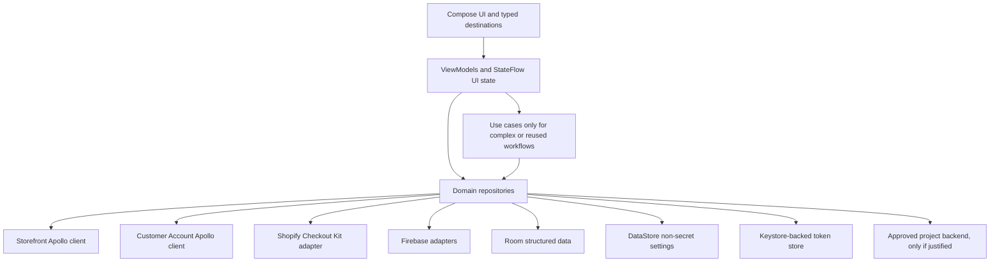

# Architecture Direction

Date: 2026-07-19
Decision status: **APPROVED PHASE 2 BASELINE**
Formal record: [ADR-0001](../decisions/ADR-0001-NATIVE-ANDROID-KOTLIN-COMPOSE.md)
Navigation record: [ADR-0002](../decisions/ADR-0002-NAVIGATION-COMPOSE-2-TYPED-ROUTES.md)
SDK baseline record: [ADR-0003](../decisions/ADR-0003-ANDROID-SDK-BASELINE.md)

## Decision

Build the Android product as a new native Kotlin application with Jetpack Compose. Use Android's recommended single-activity, layered, unidirectional-data-flow architecture. Do not continue or migrate the old Flutter prototype, and do not translate decompiled APK implementation.

This is an Android-first product decision, not a universal rejection of cross-platform frameworks. Because shared iOS source is not required, Flutter's and React Native's main strategic advantage receives little weight. Native Android provides first-class Shopify Checkout Kit, Firebase, lifecycle, deep-link, security, profiling, accessibility, and test tooling without a project-owned runtime bridge. A future iOS product may be independently authored in Swift + SwiftUI against the same neutral requirements and contracts.

## Runtime architecture

- Compose renders immutable screen state and sends events upward.
- ViewModels own presentation state and expose `StateFlow`; they do not contain SDK-specific UI objects.
- Repositories are the source of truth for domains and coordinate explicit data sources.
- Use cases are optional. Add them only for complex orchestration or behavior reused by multiple ViewModels.
- Hilt supplies dependencies at explicit scopes. Coroutines and Flow provide structured concurrency and streams.
- Feature modules may be introduced when boundaries are real; avoid empty module ceremony in the initial scaffold.

This follows Android's current recommendations for UI/data layers, single source of truth, unidirectional data flow, ViewModels, coroutines/Flow, and dependency injection: [Guide to app architecture](https://developer.android.com/topic/architecture).

## Shopify boundaries

### Storefront API

- Use Apollo Kotlin and generated, operation-specific Kotlin models.
- Keep the Storefront schema/client/version/cache policy separate from Customer Account API.
- Model pagination, user errors, nullability, retries, offline behavior, and cart recovery explicitly.
- Treat the Storefront access token as an extractable but controlled public client credential, never as a customer/session token or server secret. Required scanning may inspect it; ordinary output and logs must redact it.
- Do not introduce Retrofit merely for symmetry. Add a REST client only when an approved project-owned REST service exists.

Primary references: [Shopify mobile storefronts](https://shopify.dev/docs/storefronts/mobile/about-mobile-storefronts), [Apollo Kotlin](https://www.apollographql.com/docs/kotlin).

### Customer Account API

- Use Shopify's current OAuth 2.0 authorization-code flow with PKCE for a Mobile client.
- Launch authorization in Custom Tabs through AppAuth-Android; never embed credentials in a WebView.
- Use the Shopify-required `shop.{shop_id}.*` custom-scheme callback. Use verified Android App Links for project-owned HTTPS/offsite return paths where applicable.
- Keep access/refresh tokens in a Keystore-backed token store; implement expiry, rotation, cancellation, logout, route reset, and redacted diagnostics.
- Use Customer Account API for profile, addresses, orders, and current account behavior. Legacy email/password accounts are not a target parity contract.
- Choose authenticated-checkout propagation deliberately: cart buyer identity and/or Checkout Kit customer-account integration must be proven against the owned test store.

Primary references: [Customer Account API](https://shopify.dev/docs/storefronts/headless/building-with-the-customer-account-api), [Getting started](https://shopify.dev/docs/storefronts/headless/building-with-the-customer-account-api/getting-started), [Checkout authentication](https://shopify.dev/docs/storefronts/headless/building-with-the-customer-account-api/checkout-authentication), [AppAuth-Android](https://github.com/openid/AppAuth-Android), [Android App Links](https://developer.android.com/training/app-links).

### Checkout

- Integrate Shopify Checkout Kit for Android directly through a project-owned adapter.
- Pass the Storefront cart `checkoutUrl`; support preload, lifecycle callbacks, recoverable/fatal errors, customer-account identity, privacy/consent, offsite returns, and cache invalidation.
- Keep SDK types behind the adapter and test the adapter contract with fakes.
- Validate a real non-production test-store checkout on a physical device before checkout-dependent feature acceptance.

Primary references: [Shopify Checkout Kit](https://shopify.dev/docs/storefronts/mobile/checkout-kit), [Android SDK repository](https://github.com/Shopify/checkout-sheet-kit-android).

## Android platform stack

| Concern | Selected direction | Boundary |
|---|---|---|
| UI | Kotlin + Jetpack Compose, Material 3 | Design tokens and accessibility semantics are project-owned |
| State/concurrency | ViewModel, `StateFlow`, coroutines/Flow | No SDK calls from composables |
| Dependency injection | Hilt | Constructor injection; explicit scopes |
| Navigation | Current stable Navigation Compose 2 line with Kotlin-serialization typed routes | Deep links are allowlisted and tested; see ADR-0002 |
| GraphQL | Apollo Kotlin current stable at scaffold time | Separate Storefront and Customer Account clients |
| Checkout | Official Shopify Checkout Kit Android current stable | Adapter and lifecycle contract |
| OAuth | AppAuth-Android + Custom Tabs + PKCE | Keystore-backed token store |
| Structured local data | Room | Search/wishlist/sync data only when required |
| Small non-secret state | DataStore | Preferences/config flags; never OAuth tokens |
| Durable background work | WorkManager | Only work that must survive process/reboot |
| Images | Coil Compose, if image requirements justify it | Injected loader and deterministic test doubles |
| Firebase | Android BoM main modules | Messaging, Remote Config, Analytics, Crashlytics; consent-aware |
| Logging | Thin project logger over platform tooling | Redaction by default; no tokens/customer content |
| Serialization | Kotlin serialization where non-GraphQL models require it | No dynamic maps at domain/UI boundaries |

Use current stable compatible versions when the scaffold is created and lock them through Gradle version catalogs and dependency verification. Do not pin Phase 1 research snapshots as future implementation requirements. Firebase Kotlin code must use main modules, not the retired standalone KTX artifacts: [Firebase Android setup](https://firebase.google.com/docs/android/setup).

Navigation 3 remains the Compose-first strategic alternative, but its first-party deep-link matching is in the `1.2` alpha line as of this decision. The stable Navigation Compose `2.9` line is selected for the initial OAuth/App Link/checkout-return foundation; reassess under [ADR-0002](../decisions/ADR-0002-NAVIGATION-COMPOSE-2-TYPED-ROUTES.md) when Navigation 3 deep links are stable.

## Android release baseline

- Phase 2 uses the final stable Android 16 platform: `compileSdk = 36` and `targetSdk = 36`. Android 17/API 37 remains a preview SDK at the 2026-07-19 execution recheck and is not the production baseline.
- Start with `minSdk = 23`, the current shared floor documented by Shopify Checkout Kit and Firebase Android. Before locking it, recheck every selected SDK floor, approved device/support coverage, required platform APIs, desugaring/backports, and tests on API 23 plus representative higher APIs; use the highest required floor.
- Treat Android 17/API 37 and its QPR releases as a separate compatibility lane. Test them without changing the production compile/target baseline until the platform/SDK reaches a final release and is deliberately adopted.
- Before release, complete Android developer identity verification and register the final package names/signing ownership through Play Console or Android Developer Console as appropriate. Keep signing private material within the approved signing/CI boundary.

Primary references: [ADR-0003](../decisions/ADR-0003-ANDROID-SDK-BASELINE.md), [Android 17 SDK](https://developer.android.com/about/versions/17/setup-sdk), [Android 16](https://developer.android.com/about/versions/16), [Google Play target API requirements](https://support.google.com/googleplay/android-developer/answer/11926878), [Android Gradle Plugin releases](https://developer.android.com/build/releases/gradle-plugin), [Android developer verification](https://developer.android.com/developer-verification), [Shopify Checkout Kit](https://shopify.dev/docs/storefronts/mobile/checkout-kit), and [Firebase Android setup](https://firebase.google.com/docs/android/setup).

## Storage and sync

- Keystore-backed encrypted material: customer OAuth access/refresh tokens and equivalent session material.
- DataStore: onboarding, non-secret preferences, selected locale, safe feature flags, and small config state.
- Room: relational/offline data such as wishlist, search history, sync queue/state, or cached domain data only when the product requires it.
- WorkManager: durable sync, token/register operations, or retries that genuinely must survive process death; ordinary requests stay in coroutine scopes.
- Firebase Remote Config must have safe local defaults. Analytics/Crashlytics/Performance must be consent-aware and exclude secrets/private content.

Primary references: [Android Keystore](https://developer.android.com/privacy-and-security/keystore), [DataStore](https://developer.android.com/topic/libraries/architecture/datastore), [Room](https://developer.android.com/training/data-storage/room), [WorkManager](https://developer.android.com/topic/libraries/architecture/workmanager).

## Multi-brand and future iOS

Multi-brand reuse is contract-level and build-time/runtime configuration reuse: feature specifications, Storefront/Customer Account operations, design-token schema, content/config schema, fixtures, acceptance suites, CI/release conventions, and analytics event contracts. Brand modules must not be arbitrary remote code or an excuse for one runtime.

If iOS is approved later, create a native Swift + SwiftUI application using the official Shopify Swift Checkout Kit and the same neutral product/API contracts. UI, navigation, lifecycle, accessibility, secure storage, and Firebase integration remain platform-native. Kotlin Multiplatform is not part of the initial baseline; it may be reconsidered only after duplicated stable domain code demonstrates a measured benefit.

Primary reference: [Shopify Checkout Kit for Swift](https://github.com/Shopify/checkout-sheet-kit-swift).

## Verification architecture

- JVM unit tests for pure policy, mapping, validation, reducers, and use cases.
- Coroutine/Flow tests with controlled schedulers.
- Apollo test tooling and MockWebServer/fakes for Storefront, Customer Account, OAuth, and error contracts.
- Compose UI and instrumentation tests for navigation, state restoration, accessibility semantics, lifecycle, deep links, and permissions.
- Physical-device tests for Checkout Kit, OAuth redirect, push, process death, network transitions, and offsite returns.
- Android Lint, formatting, detekt, dependency/secret scanning, release build checks, and dependency verification in CI.
- Macrobenchmark and Baseline Profiles for agreed critical journeys; measure before optimizing.

Primary references: [Compose testing](https://developer.android.com/develop/ui/compose/testing), [Baseline Profiles](https://developer.android.com/topic/performance/baselineprofiles/overview).

## Phase 2 gates

Phase 2 may create the native scaffold only after its new prompt confirms scope. Before accepting commerce/account features, it must also have project-owned non-production Shopify/Firebase environments, a physical Android device, approved brand assets/content, a threat model, and explicit backend ownership if any backend is introduced.
